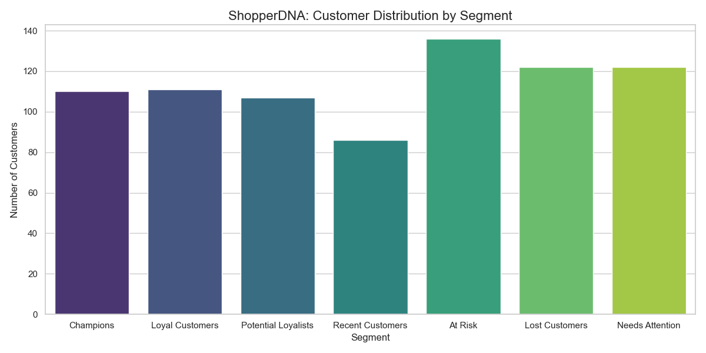

# ShopperDNA: Behavioral Customer Intelligence 🧬

**ShopperDNA** is a sophisticated analytics engine that transforms raw e-commerce transaction data into actionable customer intelligence. By leveraging advanced SQL window functions and RFM (Recency, Frequency, Monetary) analysis, it identifies high-value "Champions" and "At Risk" customers.

## 🔴 Live Demo
> **[Click here to Launch the Interactive Dashboard](https://share.streamlit.io/deploy?repository=gubbalamanasa30/ShopperDNA-Intelligence&branch=master&mainModule=app.py)**


## 🚀 Features

*   **Advanced Segmentation**: Categorizes customers into 7 distinct segments (e.g., *Champions, Loyal Customers, At Risk*) using standard RFM scoring.
*   **SQL-Powered Engine**: Utilizes CTEs and `NTILE()` window functions for robust and scalable scoring.
*   **Interactive Dashboard**: A Streamlit-based web application to filter, search, and explore customer "DNA".
*   **Actionable Insights**: Identifies revenue sets at risk and opportunities for cross-selling.

## 📊 Tech Stack

*   **Database**: SQLite
*   **Analysis**: Python (`pandas`) & SQL
*   **Visualization**: `plotly`, `seaborn`
*   **App Framework**: `streamlit`

## 🛠️ Installation & Usage

1.  **Clone the Repository**
    ```bash
    git clone https://github.com/gubbalamanasa30/ShopperDNA.git
    cd ShopperDNA
    ```

2.  **Install Dependencies**
    ```bash
    pip install -r requirements.txt
    ```

3.  **Run the Analysis (ETL)**
    ```bash
    # 1. Load data into SQLite
    python data_loader.py
    
    # 2. Run standard RFM analysis
    python analysis_runner.py
    ```

4.  **Launch the Dashboard**
    ```bash
    streamlit run app.py
    ```

## 📂 Project Structure

*   `rfm_analysis.sql`: The core analytical engine (SQL logic).
*   `app.py`: The interactive dashboard application.
*   `data_loader.py`: ETL script to load raw CSV into SQLite.
*   `analysis_runner.py`: Orchestrator script.

## 📈 Dataset

The project uses the **Sample Superstore** dataset, which contains 9,994 retail transactions including:
*   Order Date & Ship Date
*   Sales, Profit, Quantity
*   Customer Name & Location
*   Categories & Sub-Categories

## 🏆 Visualizations

The dashboard provides deep dives into customer behavior:

### Segment Distribution


*Distribution of customer base by segment. Note the significant portion of "At Risk" customers requiring re-engagement.*

---
*Built with ❤️ by [Your Name]*
